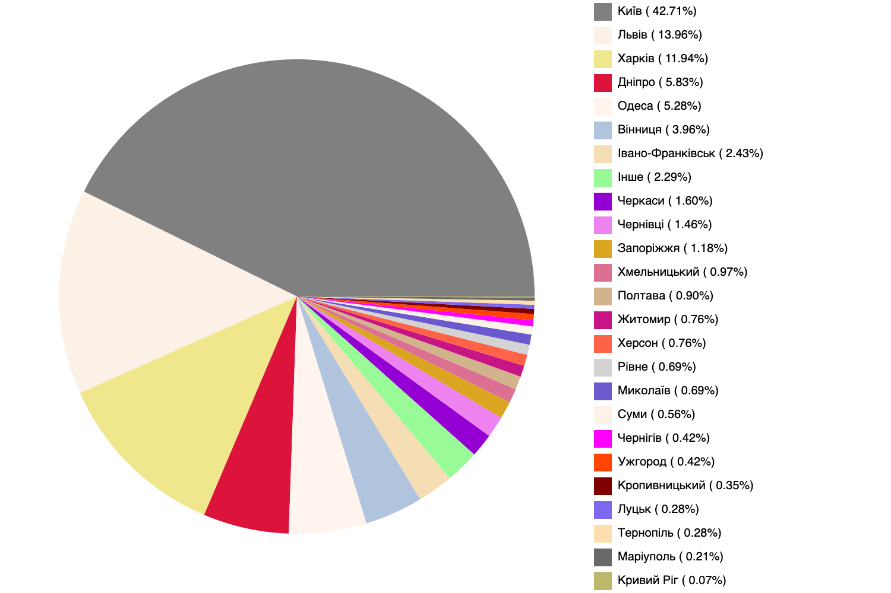

# Canvas + Работа с объектами

**ВНИМАНИЕ:**
Для работы скрипта распаковать архив "2021_june_raw.7z"

## Описание
Дано результати зарплатного опитування DOU.ua

Потрібно:
1. Вивести в консоль (за спаданням) середню зарплату FE розробників за містами у форматі
```
    Average salary of FE developers in city_1 is salary_1$
    Average salary of FE developers in city_2 is salary_2$
    etc.
```

2. Відобразити на графіку засобами canvas (за спаданням) в яких містах проживають респонденти
опитування, що працюють FE розробниками.

