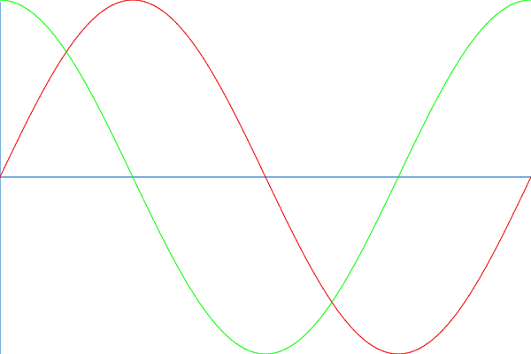
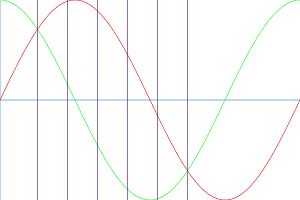
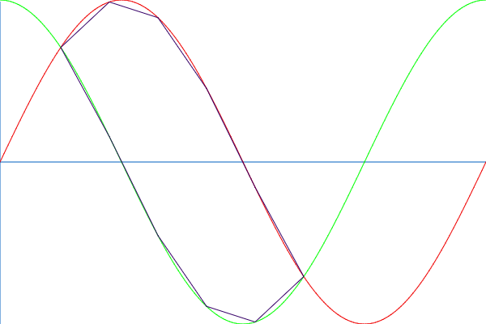
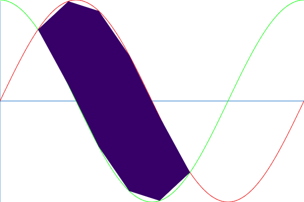

# Тригонометрия
Тестовое задание с курсов компании SPD University

## Задания
1. Задати синусоїду та косинусоїду на проміжку `[0..2π]`:

2. Інтервал `[π/4..5π/4]` поділити на `N` (3 і більше) діапазонів вертикальними лініями. У прикладі нижче `N=5`:

3. Точки перетину вертикальних ліній з синусоїдою та косинусоїдою послідовно з'єднати лінією:

4. Знайти площу утвореного полігона:

5. Знайдене значення вивести в консоль.

За бажанням зробити візуалізацію на канві. 